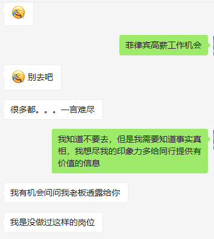

# 你找的工作安全吗？

> * 作者：陈大鱼头
> * github：<https://github.com/KRISACHAN>
> * 背景：近日在朋友圈里流传了一个很让人难受的视频，视频内容是据说是 **程序员因为写的代码出现了 bug，而被管理层的人找打手修理** ，不管视频内容真假（当然希望是假的），我们在找工作的过程中都应该注意安全。

## 关于 “菠菜”

### “菠菜”事件

最近网上流传着一件很轰动的事，就是国内有 **黑心公司** 、 **黑心HR** 、 **黑心猎头** 打着高薪招聘的幌子骗人出国工作，看着是从事轻松且高薪的工作，实际上是被卖到东南亚去给 **博彩** 行业做苦力，对，不听话打死的那种！

当然，上面的事件未经证实，或许是有，或许是谣传，但是未必就是空穴来风。不然 **“澳门首家线上赌场”** 是从何而来的呢？

**当然，我更希望这只是谣传，只是以讹传讹，所有出国工作的同胞都轻松实现财务自由！！！**

从百度上搜索 **“菲律宾 博彩 招聘”**

可以看到以下结果

除了最上面的招聘信息，下面的都是相关的负面新闻。

在招聘信息给出的薪资也不低，而且有意思的是，要么是人力资源公司，要么是某公司，要么就直接说明是菠菜。

### 疑似事实

我们再看看网图：

**据说是被卖后的求救动态**

**挨打GIF**

**挨打视频**

<video autoplay src="img/3.mp4"></video>

**以上的图片与视频都未经证实（我非常希望被证实是谣言，是我被打脸，我不愿意相信是真的）。**

### 相关对话

**下面是我跟某做菲律宾项目的猎头的对话：**

**上面是相关信息的聊天截图**

从上面我们可以得知，在菲律宾，**“菠菜”** 有合法，有不合法的，合法的能守法，不合法的能做到什么程度，不得而知。

另外这里也提到了 **“国内去做非法项目的大多都在偏僻城市”** ，作为一个中国公民，这是要守中国的法律的，既然是非法项目，别说保证不了人身安全，即便保证得了，那么你的职业生涯中就多了一个这辈子都无法洗清的污点，甚至有可能触犯法律。

### 法律相关

**我们来看两条法律相关的信息**

**所以即便安全又高薪，但是作为中国公民的你，这已经是违法了**

## 后记

当然，是不是都不安全，还是都安全，还是有的安全，有的不安全呢？具体的鱼头我也无法考证。。。当然，可能我确定不安全之后，就再也没办法传递任何信息了。。

关于这相关的信息，也有人这么说

具体如何我已经在托猎头朋友去了解相关的信息。

有具体的信息会及时更新这个repo，github地址是：

<https://github.com/KRISACHAN/staySafe>

大家可以持续关注！

或者大家有什么求职相关的坑与问题也欢迎在这个 [项目](https://github.com/KRISACHAN/staySafe) 下提 **issue** 来让更多人知道。金九银十，最近正是学生毕业季，很多涉世未深的学生没有社会经验恐怕容易被骗，希望看到这篇文章的你可以分享出去让更多人看到！

 
 
如果你、喜欢探讨技术，或者对本文有任何的意见或建议，你可以扫描下方二维码，关注微信公众号“<b>鱼头的Web海洋</b>”，随时与鱼头互动。欢迎！衷心希望可以遇见你。
 
 
